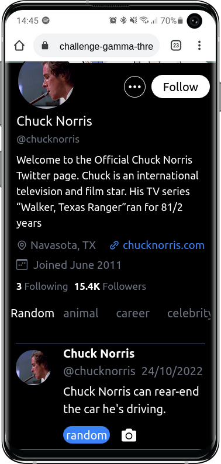
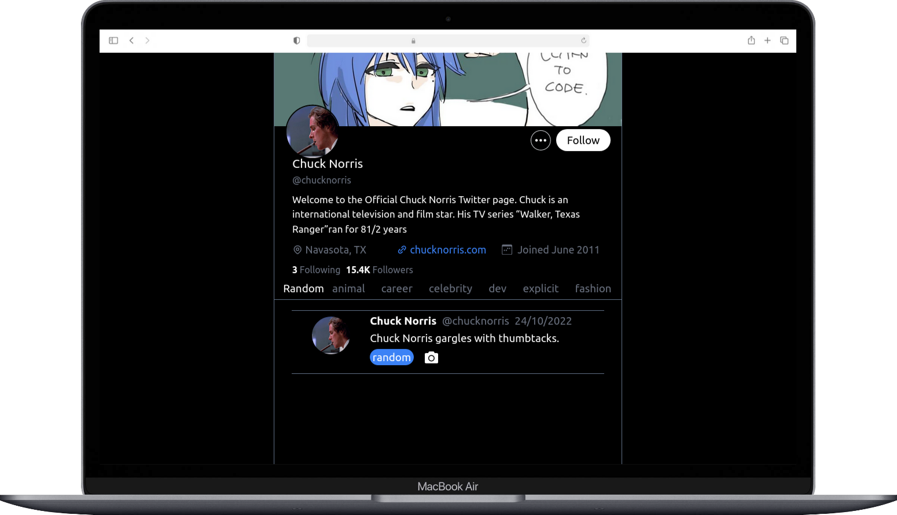

# Generador de Bromas

Aplicación donde puedes ver bromas de Chuck Norris, ya sea una broma random o cualquiera bromas de las categorías que se muestran.

También puedes sacarle una captura de pantalla a la broma y ver su fecha de generación.

---

## Tecnologías:

Una lista de tecnologías que use en este proyecto:

- [Tailwind](https://vitejs.dev/): Version 3.0.24
- [Vite](https://tailwindcss.com/): Version 2.9.9
- [React.js](https://es.reactjs.org/) : Version 18

---

## Capturas de pantalla:





## Descripción del Proyecto:

Inicie creando la UI, basándome en Twitter muy responsivo, luego cree un customHook (UseFetch) para hacer las llamadas a los diferentes endpoint de la api.

Implemente el customHook para traer las categorías, usando el estado de este hook, para recorrerlo y mostrarlas en pantallas.

Cree un contexto (JokeContext) como manejador de estado global, pase el estado, y el setEstado de este contexto a los componentes Categorie y Twitt; reutilice la función getInfo del UseFetch en un useEffect dentro del componente Twitt y hago la 2da petición con el endpoint para traer un broma random y se lo paso al setEstado del contexto y uso el estado del contexto en el componente Twitt, para mostrar la info en pantalla.

En la segunda parte: el setEstado del contexto lo uso para actualizar mi estado global con los botones de las categorías a los cuales les paso una función (getJokeCate) que recibe como parámetro la categoría, vuelvo a usar el UseFetch para hacer la llamada a ese endpoint y actualizo el estado global con el setEstado del context agregándole una propiedad de categoría, para distinguir a que pertenece la broma que se está renderizando.

### Otras Implementaciones:

Uso de la libreria Html2Canvas para sacar una captura de pantalla al "twitt".

Así como una función para saber la fecha actual y mostrarla en pantalla y aparentarlo más twitter.

### Por corregir:

A veces cuando hay click en alguno de los botones que ejecutan llamadas a la api, estos muestras un undefined en pantalla, de momento se corrigen volviendo hacer la petición o click.

---

## Instalación:

```
git clone https://github.com/Dalex19/Polpo-challenge.git

cd Polpo-challenge

npm install or npm i

npm run dev

visit http://localhost:5173/
```
